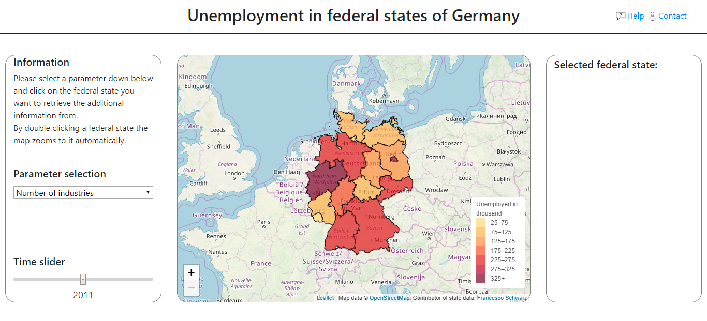
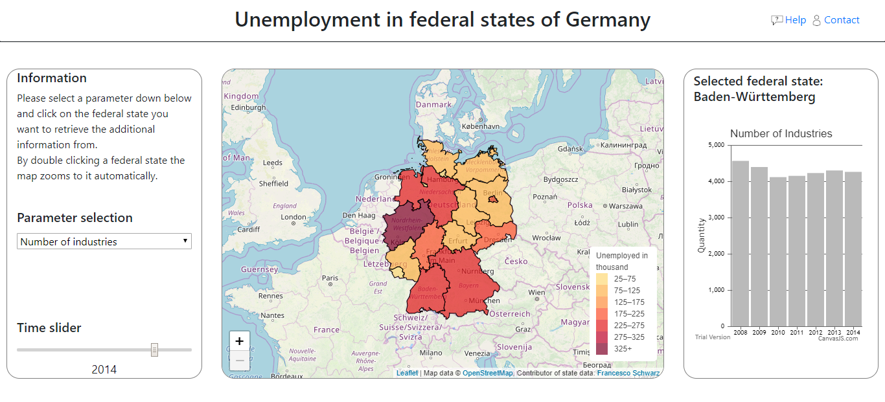
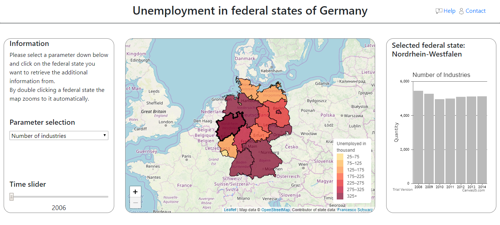

# GI4Society
Repository for the project of Geoinformation in Society (WS 2017/2018).

Project members:
- Raphael Witt
- Zhendong Yuan

To get the project application running, just download/clone this repository and open the *index.html* in the www-Folder.
There are no further installations required.

### License
MIT License.
This is the license for the source code, NOT INCLUDING THE DATA OR ANY USED LIBRARY.
